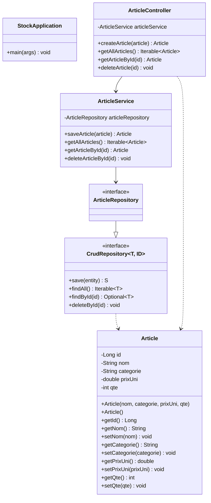

# Diagramme de classes

```mermaid
classDiagram
    class StockApplication {
        +main(args) void
    }

    class ArticleController {
        -ArticleService articleService
        +createArticle(article) Article
        +getAllArticles() Iterable~Article~
        +getArticleById(id) Article
        +deleteArticle(id) void
    }

    class ArticleService {
        -ArticleRepository articleRepository
        +saveArticle(article) Article
        +getAllArticles() Iterable~Article~
        +getArticleById(id) Article
        +deleteArticleById(id) void
    }

    class ArticleRepository {
        <<interface>>
    }

    class CrudRepository~T, ID~ {
        <<interface>>
        +save(entity) S
        +findAll() Iterable~T~
        +findById(id) Optional~T~
        +deleteById(id) void
    }

    class Article {
        -Long id
        -String nom
        -String categorie
        -double prixUni
        -int qte
        +Article(nom, categorie, prixUni, qte)
        +Article()
        +getId() Long
        +getNom() String
        +setNom(nom) void
        +getCategorie() String
        +setCategorie(categorie) void
        +getPrixUni() double
        +setPrixUni(prixUni) void
        +getQte() int
        +setQte(qte) void
    }

    ArticleController --> ArticleService
    ArticleService --> ArticleRepository
    ArticleRepository --|> CrudRepository
    CrudRepository ..> Article
    ArticleController ..> Article
```
